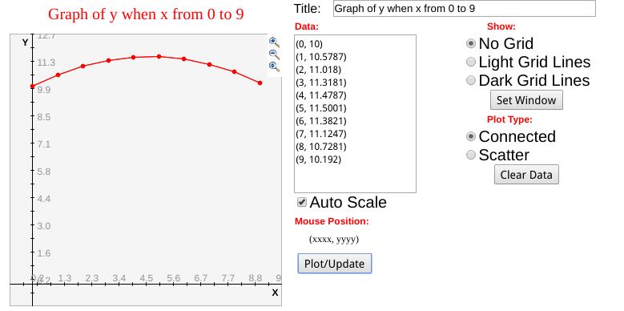
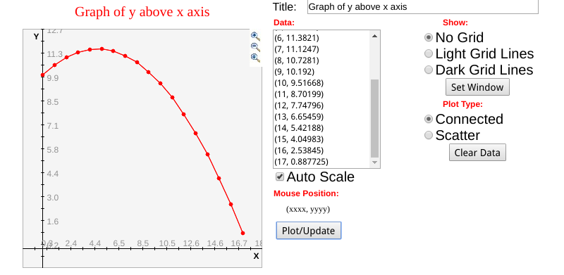

# Lab 03 Report

## Part A

### 1.

Pseudocode:

```
DECLARE v, angle, y0, y OF TYPE FLOAT
DECLARE x OF TYPE INTEGER

FUNCTION calc_height(x, v, angle, y0) OF TYPE FLOAT
    RETURN y0 + x * tan(angle) - ((9.81 * x * x) / (2 * (v * cos(angle)) *
                                                        (v * cos(angle))))
ENDFUNC

INPUT v, angle, y0

x = 0
y = y0

WHILE x <= 9,
  THEN
    OUTPUT x, y
    y = calc_height(x, v, angle, y0)
    x = x + 1
ENDWHILE
```


### 2.

[lab03Autil.h](code/partA/lab03Autil.h):

```cpp
#ifndef LAB03AUTIL_H
#define LAB03AUTIL_H

#include <string>

#define G 9.81

double input_double(std::string prompt);

void output_coordinate(int x, double y);

double calc_height(int x, double v, double angle, double y0);

#endif
```

[lab03Autil.cpp](code/partA/lab03Autil.cpp):

```cpp
#include <iostream>
#include <cmath>

#include "lab03Autil.h"

using namespace std;


double input_double(string prompt)
{
    double input;

    cout << prompt;
    cin >> input;

    return input;
}

void output_coordinate(int x, double y)
{
    cout << "(" << x << ", " << y << ")" << endl;
}

double calc_height(int x, double v, double angle, double y0)
{
    return y0 + x * tan(angle) - ((G * x * x) / (2 * (v * cos(angle)) * (v * cos(angle))));
}
```

[lab03A2.cpp](code/partA/lab03A2.cpp):

```cpp
#include "lab03Autil.h"


int main()
{
    int x = 0;
    double v, angle, y0, y;

    v = input_double("Enter the speed: ");
    angle = input_double("Enter the launch angle: ");
    y0 = input_double("Enter the initial height: ");

    y = y0;

    while (x <= 9) {
        y = calc_height(x, v, angle, y0);
        output_coordinate(x, y);
        x++;
    }
}
```

Command line run:

```sh
$ clang++ lab03A2.cpp lab03Autil.cpp -o ../../bin/partA/lab03A2

$ ./../../bin/partA/lab03A2
Enter the speed: 10
Enter the launch angle: 10
Enter the initial height: 10
(0, 10)
(1, 10.5787)
(2, 11.018)
(3, 11.3181)
(4, 11.4787)
(5, 11.5001)
(6, 11.3821)
(7, 11.1247)
(8, 10.7281)
(9, 10.192)
```

Graph from [shodor](http://www.shodor.org/interactivate/activities/SimplePlot/):


### 3.

Pseudocode:

```
DECLARE v, angle, y0, y OF TYPE FLOAT
DECLARE x OF TYPE INTEGER

FUNCTION calc_height(x, v, angle, y0) OF TYPE FLOAT
    RETURN y0 + x * tan(angle) - ((9.81 * x * x) / (2 * (v * cos(angle)) *
                                                        (v * cos(angle))))
ENDFUNC

INPUT v, angle, y0

y = y0

FOR x = 0 TO 9,
  THEN
    OUTPUT x, y
    y = calc_height(x, v, angle, y0)
ENDFOR
```


### 4.

We like code from 4 better, since a `for` loop is more suitable for counting than a `while` loop.

Reuse [lab03Autil.cpp](code/partA/lab03Autil.cpp) and [lab03Autil.h](code/partA/lab03Autil.h).

[lab03A4.cpp](code/partA/lab03A4.cpp):

```cpp
#include "lab03Autil.h"


int main()
{
    int x;
    double v, angle, y0, y;

    v = input_double("Enter the speed: ");
    angle = input_double("Enter the launch angle: ");
    y0 = input_double("Enter the initial height: ");

    y = y0;

    for (x = 0; x <= 9; x++) {
        y = calc_height(x, v, angle, y0);
        output_coordinate(x, y);
    }
}
```

Command line run:

```sh
$ clang++ lab03A4.cpp lab03Autil.cpp -o ../../bin/partA/lab03A4

$ ./../../bin/partA/lab03A4
Enter the speed: 10
Enter the launch angle: 10
Enter the initial height: 10
(0, 10)
(1, 10.5787)
(2, 11.018)
(3, 11.3181)
(4, 11.4787)
(5, 11.5001)
(6, 11.3821)
(7, 11.1247)
(8, 10.7281)
(9, 10.192)
```

Graph from [shodor](http://www.shodor.org/interactivate/activities/SimplePlot/):




### 5.

This is reasonable because in a normal projectile motion would stop when the object hits the ground.

Put the calculation of `y` and condition before output.

Pseudocode:

```
DECLARE v, angle, y0, y OF TYPE FLOAT
DECLARE x OF TYPE INTEGER

FUNCTION calc_height(x, v, angle, y0) OF TYPE FLOAT
    RETURN y0 + x * tan(angle) - ((9.81 * x * x) / (2 * (v * cos(angle)) *
                                                        (v * cos(angle))))
ENDFUNC

INPUT v, angle, y0

x = 0
y = y0

y = calc_height(x, v, angle, y0)
WHILE y >= 0,
  THEN
    OUTPUT x, y
    x = x + 1
    y = calc_height(x, v, angle, y0)
ENDWHILE
```


### 6.

Reuse [lab03Autil.cpp](code/partA/lab03Autil.cpp) and [lab03Autil.h](code/partA/lab03Autil.h).

[lab03A6.cpp](code/partA/lab03A6.cpp):

```cpp
#include "lab03Autil.h"


int main()
{
    int x = 0;
    double v, angle, y0, y;

    v = input_double("Enter the speed: ");
    angle = input_double("Enter the launch angle: ");
    y0 = input_double("Enter the initial height: ");

    y = y0;

    y = calc_height(x, v, angle, y0);
    while (y >= 0) {
        output_coordinate(x++, y);
        y = calc_height(x, v, angle, y0);
    }
}
```

Command line run:

```sh
$ clang++ lab03A6.cpp lab03Autil.cpp -o ../../bin/partA/lab03A6

$ ./../../bin/partA/lab03A6
Enter the speed: 10
Enter the launch angle: 10
Enter the initial height: 10
(0, 10)
(1, 10.5787)
(2, 11.018)
(3, 11.3181)
(4, 11.4787)
(5, 11.5001)
(6, 11.3821)
(7, 11.1247)
(8, 10.7281)
(9, 10.192)
(10, 9.51668)
(11, 8.70199)
(12, 7.74796)
(13, 6.65459)
(14, 5.42188)
(15, 4.04983)
(16, 2.53845)
(17, 0.887725)
```

Graph from [shodor](http://www.shodor.org/interactivate/activities/SimplePlot/):




### 7.

Pseudocode:

```
DECLARE v, angle, y0, y OF TYPE FLOAT
DECLARE x OF TYPE INTEGER

FUNCTION calc_height(x, v, angle, y0) OF TYPE FLOAT
    RETURN y0 + x * tan(angle) - ((9.81 * x * x) / (2 * (v * cos(angle)) *
                                                        (v * cos(angle))))
ENDFUNC

INPUT v, angle, y0

x = 0
y = y0

y = calc_height(x, v, angle, y0)
FOR x = 0 TO y < 0,
  THEN
    OUTPUT x, y
    y = calc_height(x, v, angle, y0)
ENDFOR
```


### 8.

We like code from 6 better, since `while` loop makes the break condition much clearer.

Reuse [lab03Autil.cpp](code/partA/lab03Autil.cpp) and [lab03Autil.h](code/partA/lab03Autil.h).

[lab03A8util.cpp](code/partA/lab03A8.cpp):

```cpp
#include <iostream>

#include "lab03Autil.h"

using namespace std;


int main()
{
    int x = 0;
    double v, angle, y0, y;

    v = input_double("Enter the speed: ");
    angle = input_double("Enter the launch angle: ");
    y0 = input_double("Enter the initial height: ");

    y = y0;

    y = calc_height(x, v, angle, y0);
    for (; y >= 0; ) {
        output_coordinate(x++, y);
        y = calc_height(x, v, angle, y0);
    }
}
```

Command line run:

```sh
$ clang++ lab03A8.cpp lab03Autil.cpp -o ../../bin/partA/lab03A8

$ ./../../bin/partA/lab03A8
Enter the speed: 10
Enter the launch angle: 10
Enter the initial height: 10
(0, 10)
(1, 10.5787)
(2, 11.018)
(3, 11.3181)
(4, 11.4787)
(5, 11.5001)
(6, 11.3821)
(7, 11.1247)
(8, 10.7281)
(9, 10.192)
(10, 9.51668)
(11, 8.70199)
(12, 7.74796)
(13, 6.65459)
(14, 5.42188)
(15, 4.04983)
(16, 2.53845)
(17, 0.887725)
```

Graph from [shodor](http://www.shodor.org/interactivate/activities/SimplePlot/):


## Part B

### 1.

Pseudocode:

```
DECLARE gen1, gen2 OF TYPE STRING
DECLARE prob_GG, prob_Gg, prob_gg OF TYPE INTEGER

prob_GG = prob_Gg = prob_gg = 0

FUNCTION input_gen(prompt) OF TYPE STRING
    DECLARE input_str OF TYPE STRING
    OUTPUT prompt

    INPUT input_str

    WHILE NOT input_str.size() == 2,
      THEN
        OUTPUT "Re-input!"
        INPUT input_str
    ENDWHILE

    WHILE NOT (input_str[0] == 'G' OR input_str[0] == 'g'),
      THEN
        OUTPUT "Re-input!"
        INPUT input_str
    ENDWHILE

    WHILE NOT (input_str[1] == 'G' OR input_str[1] == 'g'),
      THEN
        OUTPUT "Re-input!"
        INPUT input_str
    ENDWHILE

    RETURN input_str
ENDFUNC

gen1 = input_gen("Enter genotype of parent1: ")
gen2 = input_gen("Enter genotype of parent2: ")

IF gen1 == "GG" AND gen2 == "GG"
  THEN
    prob_GG = 100
  ELSE IF gen1 == "gg" AND gen2 == "gg"
    THEN
      prob_gg = 100
    ELSE IF (gen1 == "Gg" OR gen1 == "gG") AND (gen2 == "Gg" OR gen2 == "gG")
      THEN
        prob_GG = prob_gg = 25
        prob_Gg = 50
      ELSE IF (gen1 == "GG" AND gen2 == "gg") OR (gen1 == "gg" AND gen2 == "GG")
        THEN
          prob_Gg = 100
        ELSE IF (gen1 == "GG" AND (gen2 == "Gg" OR gen2 == "gG")) OR
                (gen2 == "GG" AND (gen1 == "Gg" OR gen1 == "gG"))
          THEN
            prob_GG = prob_Gg = 50
          ELSE IF (gen1 == "gg" AND (gen2 == "Gg" OR gen2 == "gG")) OR
                  (gen2 == "gg" AND (gen1 == "Gg" OR gen1 == "gG"))
            THEN
              prob_gg = prob_Gg = 50
          ENDIF
        ENDIF
      ENDIF
    ENDIF
  ENDIF
ENDIF

OUTPUT "Probability of GG: ", prob_GG, "%"
OUTPUT "Probability of gg: ", prob_gg, "%"
OUTPUT "Probability of Gg: ", prob_Gg, "%"

OUTPUT "Probability of Yellow: ", prob_gg
OUTPUT "Probability of Greeen: ", prob_Gg + prob_GG
```


### 2.

[lab03Butil.h](code/partB/lab03Butil.h):

```cpp
#ifndef LAB03BUTIL_H
#define LAB03BUTIL_H

#include <string>

struct PhenotypeProb
{
    int yellow;
    int green;
};

struct GenotypeProb
{
    int prob_gg;
    int prob_GG;
    int prob_Gg;
};

struct ParentGenotype
{
    std::string p1;
    std::string p2;
};

struct ProbPrompt
{
    int prob;
    std::string prompt;
};


void output_offspring_geno_prob(GenotypeProb genoprob);

void output_offspring_pheno_prob(PhenotypeProb phenoprob);

ParentGenotype input_parent_geno();

GenotypeProb calc_offspring_geno_prob(ParentGenotype parentgeno);

PhenotypeProb calc_offspring_pheno_prob(GenotypeProb genoprob);

#endif
```

[lab03Butil.cpp](code/partB/lab03Butil.cpp):

```cpp
#include <iostream>
#include <string>

#include "lab03Butil.h"

using namespace std;


string input_string(string prompt)
{
    string input;

    cout << prompt;
    cin >> input;

    return input;
}

void output_prob(ProbPrompt probprompt)
{
    cout << "Probability of " << probprompt.prompt << ": " << probprompt.prob << endl;
}

void output_offspring_geno_prob(GenotypeProb genoprob)
{
    output_prob({ genoprob.prob_gg, "gg" });
    output_prob({ genoprob.prob_GG, "GG" });
    output_prob({ genoprob.prob_Gg, "Gg" });

    cout << endl;
}

void output_offspring_pheno_prob(PhenotypeProb phenoprob)
{
    output_prob({ phenoprob.green, "green" });
    output_prob({ phenoprob.yellow, "yellow" });

    cout << endl;
}

bool is_valid_geno(string geno)
{
    if (geno.size() != 2) {
        return false;
    }
    else if (!(geno[0] == 'g' ||
               geno[0] == 'G')) {
        return false;
    }
    else if (!(geno[1] == 'g' ||
              geno[1] == 'G')) {
        return false;
    }

    return true;
}

ParentGenotype input_parent_geno()
{
    string geno1, geno2;

    geno1 = input_string("Enter genotype of parent1: ");

    while (!is_valid_geno(geno1)) {
        geno1 = input_string("Invalid! Re-input: ");
    }

    geno2 = input_string("Enter genotype of parent2: ");
    while (!is_valid_geno(geno2)) {
        geno2 = input_string("Invalid! Re-input: ");
    }

    cout << endl;

    return { geno1, geno2 };
}

GenotypeProb calc_offspring_geno_prob(ParentGenotype parentgeno)
{
    int prob_gg, prob_GG, prob_Gg;
    prob_gg = prob_GG = prob_Gg = 0;

    // GG GG
    if (parentgeno.p1 == "GG" && parentgeno.p2 == "GG") {
        prob_GG = 100;
    }
    // gg gg
    else if (parentgeno.p1 == "gg" && parentgeno.p2 == "gg") {
        prob_gg = 100;
    }
    // Gg Gg
    else if ((parentgeno.p1 == "Gg" || parentgeno.p1 == "gG") &&
             (parentgeno.p2 == "Gg" || parentgeno.p2 == "gG")) {
        prob_GG = prob_gg = 25;
        prob_Gg = 50;
    }
    // GG gg
    else if ((parentgeno.p1 == "GG" && parentgeno.p2 == "gg") ||
             (parentgeno.p2 == "GG" && parentgeno.p1 == "gg")) {
        prob_Gg = 100;
    }
    // GG Gg
    else if ((parentgeno.p1 == "GG" && (parentgeno.p2 == "Gg" || parentgeno.p2 == "gG")) ||
             (parentgeno.p2 == "GG" && (parentgeno.p1 == "Gg" || parentgeno.p1 == "gG"))) {
        prob_GG = prob_Gg = 50;
    }
    // gg Gg
    else if ((parentgeno.p1 == "gg" && (parentgeno.p2 == "Gg" || parentgeno.p2 == "gG")) ||
             (parentgeno.p2 == "gg" && (parentgeno.p1 == "Gg" || parentgeno.p1 == "gG"))) {
        prob_gg = prob_Gg = 50;
    }

    return { prob_gg, prob_GG, prob_Gg };
}

PhenotypeProb calc_offspring_pheno_prob(GenotypeProb genoprob)
{
    return { genoprob.prob_gg, genoprob.prob_GG + genoprob.prob_Gg };
}
```

[lab03B2.cpp](code/partB/lab03B2.cpp):

```cpp
#include "lab03Butil.h"


int main()
{
    GenotypeProb offspring_geno_prob;

    offspring_geno_prob = calc_offspring_geno_prob(input_parent_geno());

    output_offspring_geno_prob(offspring_geno_prob);
    output_offspring_pheno_prob(calc_offspring_pheno_prob(offspring_geno_prob));

    return 0;
}
```

Command line run:

```sh
$ clang++ lab03B2.cpp lab03Butil.cpp -o ../../bin/partB/lab03B2

$ ../../bin/partB/lab03B2
Enter genotype of parent1: zerglings
Invalid! Re-input: Gg
Enter genotype of parent2: GGGG
Invalid! Re-input: GG

Probability of gg: 0
Probability of GG: 50
Probability of Gg: 50

Probability of green: 100
Probability of yellow: 0
```

## Part C

### 1.

Pseudocode:

```
DELCARE num, bound, x OF TYPE INTEGER
DECALRE is_prime OF TYPE BOOL

is_prime = TRUE

OUTPUT "Enter a number: "
INPUT num

bound = num / 2 + num % 2

FOR x = 2 TO bound,
  THEN
    IF num % x == 0,
      THEN
        is_prime = FALSE
ENDFOR

IF is_prime,
  THEN
    OUTPUT "This is a prime number"
ELSE
    OUPUT "This is not a prime number"
ENDIF
```

### 2.

[lab03Cutil.h](code/partC/lab03Cutil.h)

```cpp
#ifndef LAB03CUTIL_H
#define LAB03CUTIL_H

#include <string>

int input_integer(std::string prompt);

void output_result(bool is_prime);

bool is_prime(int num);

#endif
```

[lab03Cutil.cpp](code/partC/lab03Cutil.cpp)

```cpp
#include <iostream>

#include "lab03Cutil.h"

using namespace std;


int input_integer(string prompt)
{
    int input;

    cout << prompt;
    cin >> input;

    return input;
}

void output_result(bool is_prime)
{
    cout << "The number is " << (is_prime ? "" : "not ") << "a prime number" << endl;
}

bool is_prime(int num)
{
    int bound = num / 2 + num % 2;

    for (int i = 2; i <= bound; i++) {
        if (num % i == 0) {
            return false;
        }
    }

    return true;
}
```

[lab03C2.cpp](code/partC/lab03C2.cpp):

```cpp
#include "lab03Cutil.h"


int main()
{
    output_result(is_prime(input_integer("Enter a number: ")));

    return 0;
}
```

Command line run:

```sh
$ clang++ lab03C2.cpp lab03Cutil.cpp -o ../../bin/partC/lab03C2

$ ../../bin/partC/lab03C2
Enter a number: 1
The number is a prime number

$ ../../bin/partC/lab03C2
Enter a number: 30
The number is not a prime number

$ ../../bin/partC/lab03C2
Enter a number: 31
The number is a prime number
```


