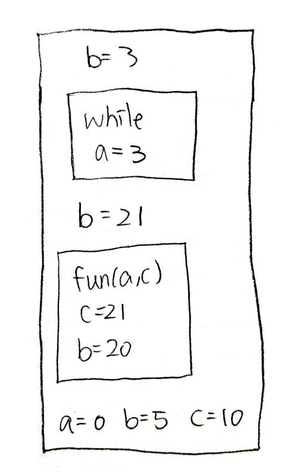
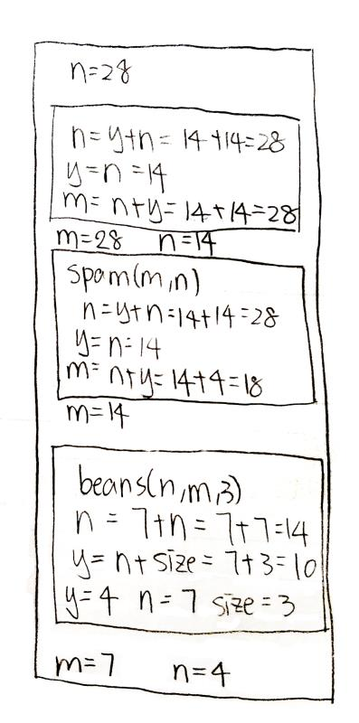

# Lab 05 Report

## Part A

Code:

[lab05A.cpp](code/partA/lab05A.cpp):

```cpp
#include <iostream>

using namespace std;


int fun(int c, int b);

int main()
{
    int a = 0, b = 5, c = 10;

    cout << "a is: " << a << " b is: " << b << " c is: " << c << endl;

    b = fun(a, c);
    cout << "a is: " << a << " b is: " << b << " c is: " << c << endl;

    while (b == 21) {
        int a = 3;
        b = a;

        cout << "a is: " << a << " b is: " << b << " c is: " << c << endl;
    }

    cout << "a is: " << a << " b is: " << b << " c is: " << c << endl;

    return 0;
}

int fun(int c, int b)
{
    b = 2 * b;
    c = b + 1;

    // Error: a not defined in this scope
    // cout << "a is: " << a << " b is: " << b << " c is: " << c << endl;

    return c;
}
```

Output:

```sh
a is 0 b is 5 c is 10
a is undefined b is 20 c is 21
a is 0 b is 21 c is 10
a is 3 b is 3 c is 10
a is 0 b is 3 c is 10
```

Error:
Line 20, inside `fun`, `a` is not defined or passsed as argument in `fun`.

Memory:


## Part B

Code:

[lab05B.cpp](code/partB/lab05B.cpp):

```cpp
#include <iostream>

using namespace std;


void beans(int y, int& n, int size);
void spam(int& n, int& y);

int main()
{
    int m = 7;
    int n = 4;

    cout << "m is " << m << " n is " << n << endl;

    beans(n, m, 3);
    cout << "m is " << m << " n is " << n << endl;

    spam(m, n);
    cout << "m is " << m << " n is " << n << endl;

    spam(n, n);
    cout << "m is " << m << " n is " << n << endl;

    // Error: a reference is required for function call, but a integer literal is passed.
    // beans(m, 2, n);
    cout << "m is " << m << " n is " << n << endl;

    return 0;
}

void beans(int y, int& n, int size)
{
    y = n + size;
    n = 7 + n;
}

void spam(int& n, int& y)
{
    int m = n + y;
    y = n;
    n = y + n;
}
```

Output:

```sh
m is 7 n is 4
m is 14 n is 4
m is 28 n is 14
m is 28 n is 28
m is 28 n is 28
```

Error:
Line 15, inside `main`, a reference is required, while a literal is passed in.

Memory:


## Part C

Psuedocode:

```
FUNCTION max_average(max OF TYPE DOUBLE, average OF TYPE DOUBLE) OF TYPE VOID
    DECLARE val OF TYPE DOUBLE
    DECLARE total OF TYPE DOUBLE
    DECLARE count OF TYPE DOUBLE
    val = total = count = 0
    max = -1

    OUTPUT "Please enter a value, or -1 when you're done."
    INTPUT val
    WHILE val != -1,
      THEN
        total += val
        count += 1

        IF val > max, THEN
          THEN
            max = val
        ENDIF

        OUTPUT "Please enter a value, or -1 when you're done."
        INTPUT val
    ENDWHILE

    average = total / count
ENDFUNC
```

[lab05C.cpp](code/partC/lab05C.cpp):

```cpp
#include <iostream>

using namespace std;


void max_average(double *max, double *average)
{
    double val = 0, total = 0, count = 0;
    *max = -1;

    cout << "Please enter a value, or -1 when you're done." << endl;
    cin >> val;
    while (val != -1) {
        total += val;
        count++;

        if (val > *max) {
            *max = val;
        }

        cout << "Please enter a value, or -1 when you're done." << endl;
        cin >> val;
    }
    *average = total / count;
}

int main()
{
    double max, average;

    max_average(&max, &average);

    cout << "max: " << max << endl << "average: " << average << endl;

    return 0;
}
```

